# python-on-windows

A step-by-step guide on installing Python and using the Command Prompt for Windows

* Version: 1.0.0
* Date: 2017-01-01
* Author: [Alberto Pettarin](http://www.albertopettarin.it/) ([contact](http://www.albertopettarin.it/contact.html))
* License: [Creative Commons Attribution 4.0 International (CC BY 4.0)](https://creativecommons.org/licenses/by/4.0/legalcode)


## Overview

Do you want to run a Python program under Windows,
but you have no experience using the Command Prompt?

This guide is for you!

I will walk you through the **installation of Python**
and I will explain the **basics of the Command Prompt**.

After reading this page (and practicing a bit),
you should be able to **run a Python program**
confidently and safely.


## What Is Python?

[Python](https://python.org/) is a
high-level, general-purpose **programming language**
which allows people to easily create and share programs
for a variety of applications.

The Python project is a free (libre)/open source software (FLOSS) initiative,
managed by the [Python Software Foundation](https://www.python.org/psf-landing/).
You can download, install, and use Python **for free**
on several platforms,
including Linux, Mac OS X, and Windows computers.

Python enables the development of FLOSS programs,
which are created for free
by millions of volunteers around the globe
and shared in **source code** form.
This means that the end user
who receives or downloads a Python program
can actually check that the program does what
is supposed to do, **and nothing more**
(unlike closed-source programs,
which send personal information to third parties,
show you advertisements, or
damage your computer).

More details on Python can be found on the
[official Python page](https://www.python.org/about/)
and on its
[Wikipedia page](https://en.wikipedia.org/wiki/Python_(programming_language)).

In practice, to use a Python program you need two pieces of software:

* the **Python interpreter**, which is the "master" program
  that reads the source code of a Python program,
  and "execute" it; and
* the **source code** of the Python program,
  usually consisting of one or more files with ``.py`` extension,
  which performs the specific task you are interested in.

This guide explains how to install the former,
and it shows how to run the latter
in the Command Prompt of Windows,
with a complete, real-life example.


## Installing Python On Windows

The preliminary step consists in installing
the Python interpreter (i.e., the "master program")
on your computer.

### Step 0: Should I Get Python 2 Or Python 3?

At the time of writing (2017-01-01),
there are two main versions of Python:
**Python 2** (2.7.13) and **Python 3** (3.6.0).

Discussing the technical differences between these two versions
is beyond the scope of this guide.
It suffices to say that
some Python programs work with both versions of Python,
while other Python programs work only
with Python 2 but not with Python 3,
or vice versa.

**You should get the version of Python that the program
you are interested in recommends.**
If the latter does not specify a version,
get the latest Python 3 version available.
If you later discover that your Python program
does not work with the Python version you installed,
do not worry: just uninstall it, and install the other one!

In the rest of the guide we assume you need **Python 3**.

### Step 1: Download The Installer

First, open your Web browser and
go to [https://python.org/](https://python.org/):

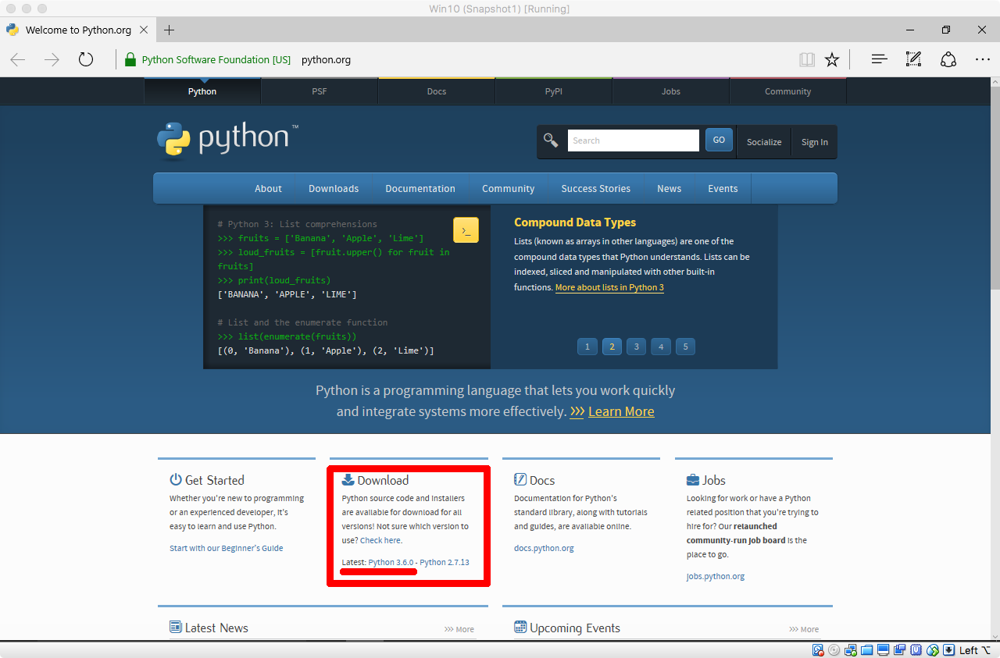

Click on the **Download > Latest Python 3.6.0** link.

You will get a page listing all the new features of Python 3.6.0:

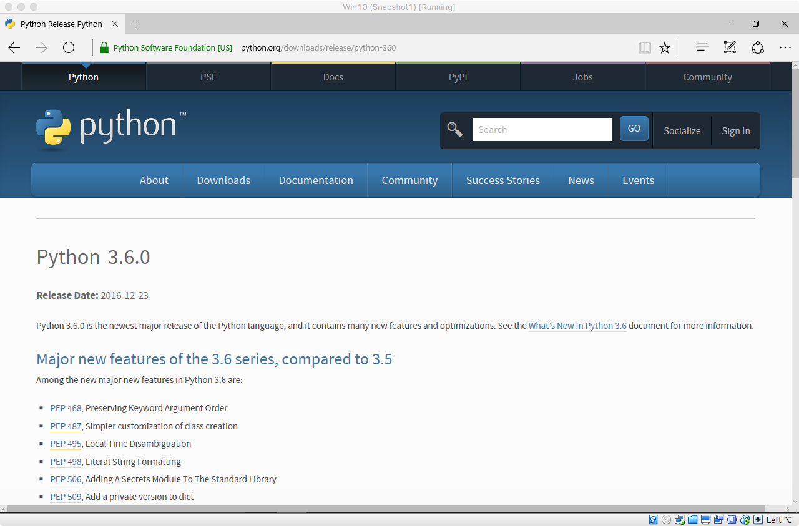

Scroll down until you see the list of available downloads:

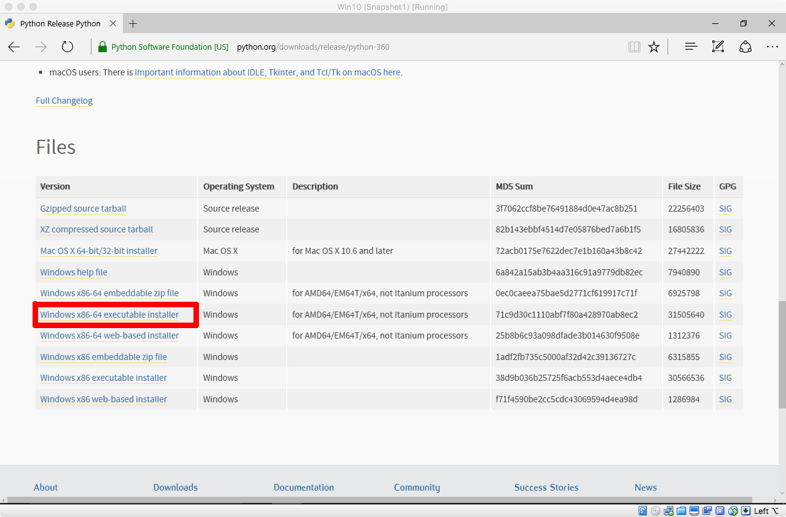

If you have a recent Windows computer,
very likely it is a 64-bit machine,
so you should download the file labeled **Windows x86-64 executable installer**,
and save it on your Download folder or on your Desktop:

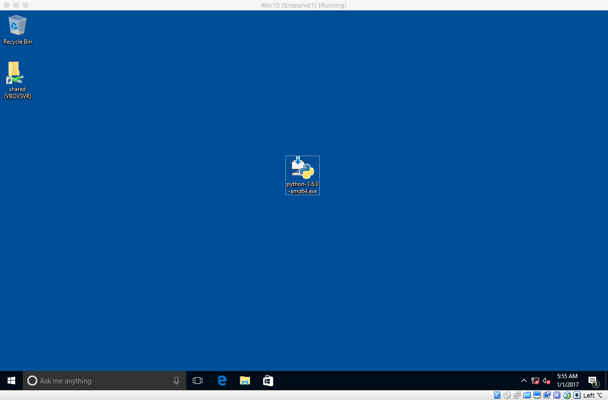

Downloading the file will take from few seconds to a few minutes,
depending on the bandwidth of your Internet connection.

(If you have an older PC that you know is a 32-bit computer,
download the **Windows x86 executable installer** instead.
You can tell whether your PC is a 32-bit or a 64-bit machine
by reading the **System Information** in the **Windows Control Panel**.)

### Step 2: Install Python

Double-click on the file you just downloaded
to start the installation wizard:

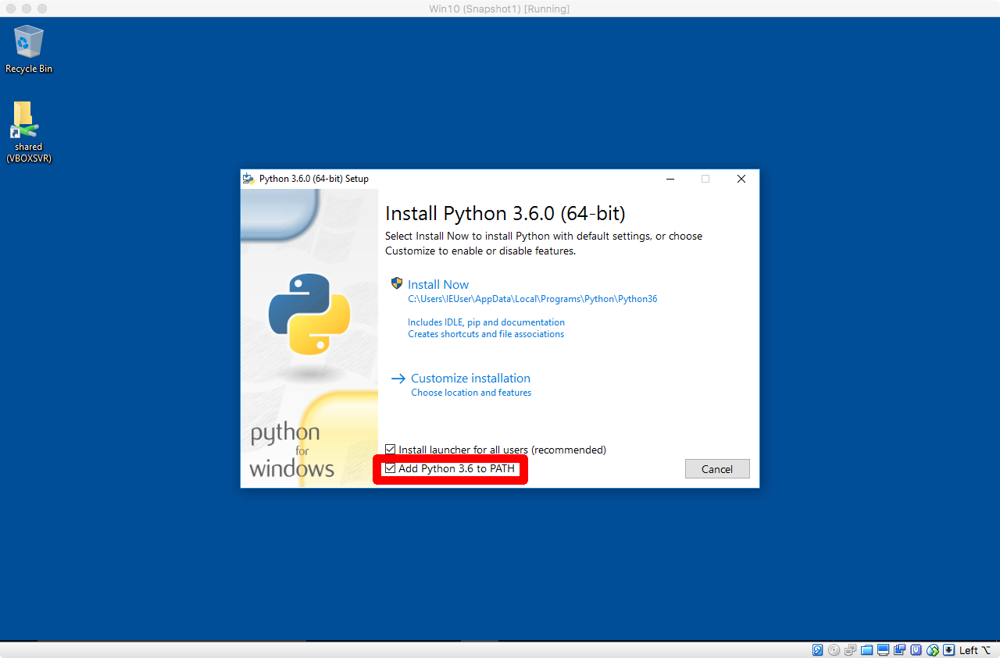

By default, the **Add Python 3.6 to PATH** option is disabled,
but **you should select it**,
as it makes running Python programs much much easier.

Most users should click the **Install Now** button,
which installs Python with the default settings.
(If you want to personalize your installation
or you are told to enable some advanced features,
click on the **Customize installation** option instead.)

The installer might ask you for administrative privileges
or for confirmations like the following:

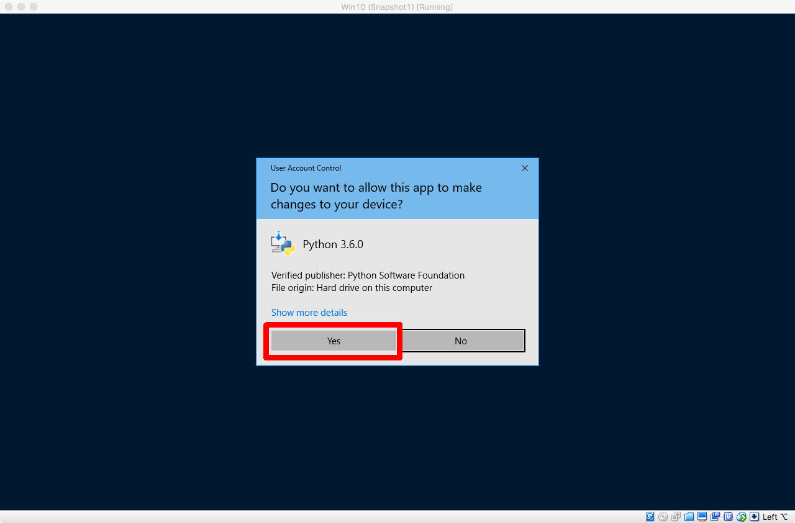

You can safely answer **Yes**.

A progress bar will appear:

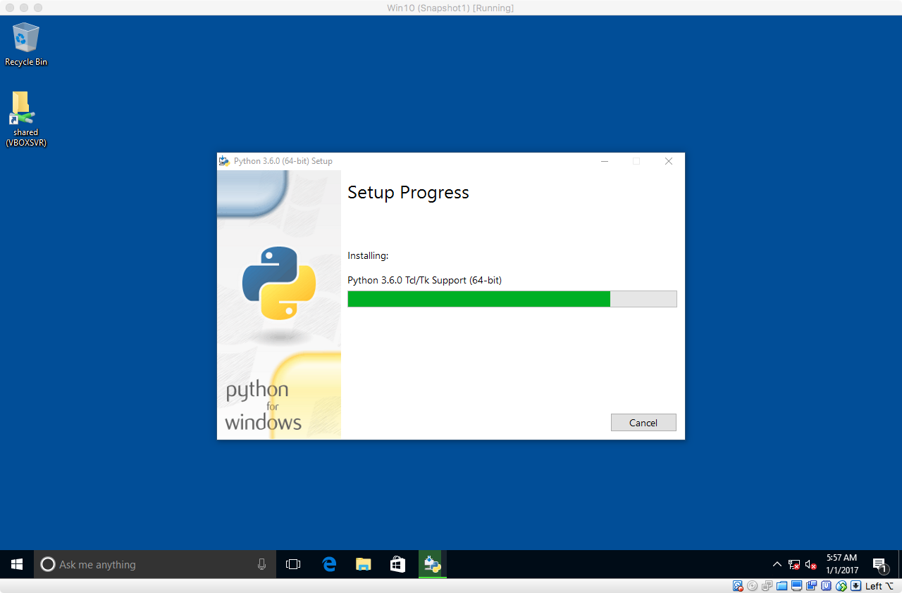

until the installation completes with the following message:

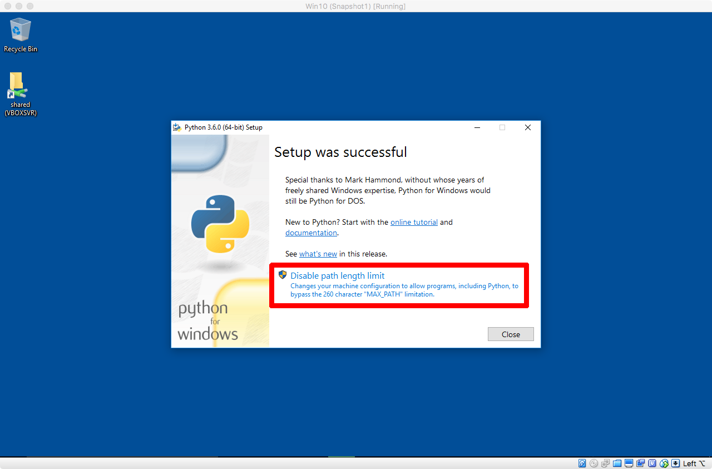

Starting with Python 3.6.0,
it is recommended to click on
the **Disable path length limit** option,
before closing the installer.
If you do so, you will get a final confirmation dialog:

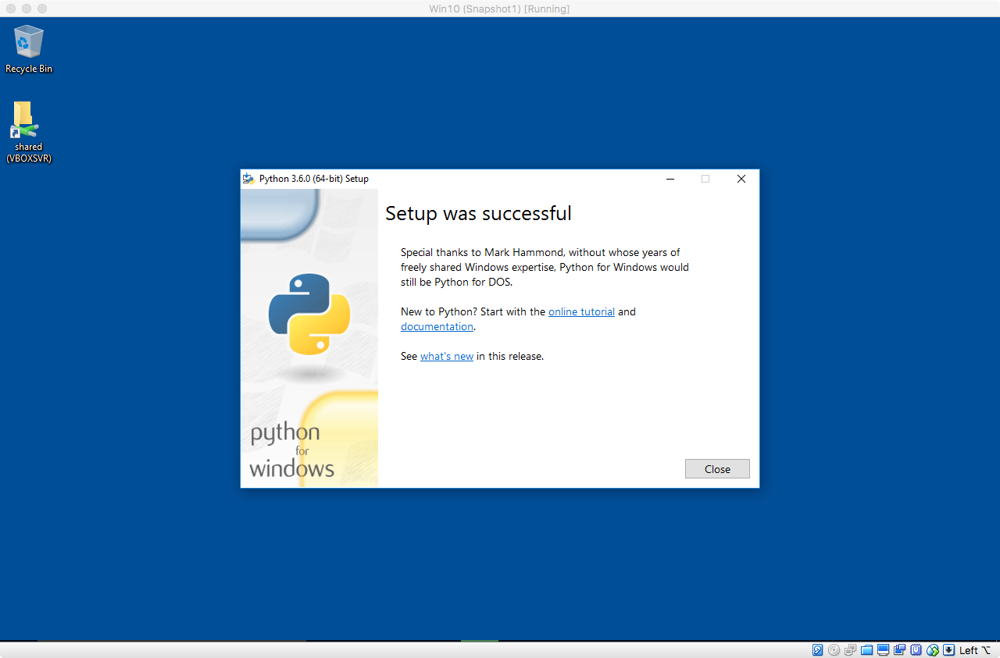

You can terminate the installation by clicking the **Close** button.

Congratulations, you have **your first Python installation** under your belt!


## Using The Command Prompt

Most Python programs are command line interface (CLI) utilities,
which means that they are not operated
via a graphical user interface (GUI),
also known as "the program window".
Instead, they must be executed
in the **Command Prompt** of Windows,
also known as "shell" or "terminal".

Running a CLI program means
**typing a command string on the Command Prompt of Windows**,
following a certain syntax
which depends on what the program is supposed to do.
You can think of this act as reciting the "right spell"
to get your job done.

### Opening A Command Prompt

To open the Command Prompt,
locate the Command Prompt icon in your Start menu
(or use the search bar):

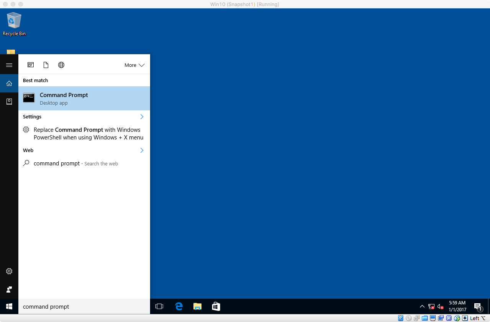

Click on the icon. A black window appears:


The first two lines printed in the window
show the version of the Command Prompt.
The last line, which reads ``C:\Users\IEUser>`` in the screenshot above,
is the **prompt**, where you can actually type commands.

The prompt line always starts
with the location of the **working directory**,
that is, the folder where the command prompt is currently acting upon
(``C:\Users\IEUser`` in the screenshot above),
and ends with the ``>`` character.

The prompt normally opens in the **home directory** of the current user:
in fact, we are in ``C:\Users\IEUser``,
because the user is called ``IEUser``.
If your Windows username is ``Olga``,
it is likely you will see
``C:\Users\Olga`` instead.

(Different versions of Windows might have different paths for home directories.)

In the documentation of Python programs you might find a ``$`` character
before examples of commands, as follows:

```
$ python my_awesome_program.py
```

because on Linux and Mac OS X machines
the terminal prompt is usually a ``$`` character.

You should **not** type the ``$`` character,
it is just a placeholder for your actual prompt.
For any practical purpose,
you can mentally replace the ``$`` with your actual prompt,
like ``C:\Users\IEUser>`` in the example above,
as if the documentation was as follows:

```
C:\Users\IEUser> python my_awesome_program.py
```

(You will actually type only ``python my_awesome_program.py`` and
hit the Enter/Return key.)

### The Three Safety Rules

By issuing commands on the Command Prompt,
you can **accidentally delete** your own files or **damage** Windows,
so you must **be careful**.

Do not be afraid or discouraged:
you do not stop using knives just because
you can cut your fingers with them!

By following **Three Safety Rules**,
you can operate the prompt safely:

1. Never issue a command without understanding what it does,
   and only run programs obtained from developers that you trust.
2. If anything happens in the prompt that you do not understand,
   you can simply click on the "X" on the right top corner
   to close the Command Prompt window
   (and hopefully nothing bad will happen to your files).
3. Always copy your Python program in a separate
   folder, and always make copies of your input files in it,
   so that you can just throw away the Python program folder
   if something goes wrong, and start over.

### Changing The Working Directory (``cd``)

As said above, the command prompt normally opens
in the home directory of your user:


If you want to change the current working directory,
you can use the ``cd`` command.
For example, to move to the ``C:\`` directory
(the root directory of your ``C:`` drive),
you type ``cd C:\``
and press the Enter/Return key:


Notice that the prompt changed to ``C:\>``.

### Listing The Contents Of The Working Directory (``dir``)

If you want a list of the files or subdirectories
contained in the current working directory,
issue the ``dir`` command, without arguments:

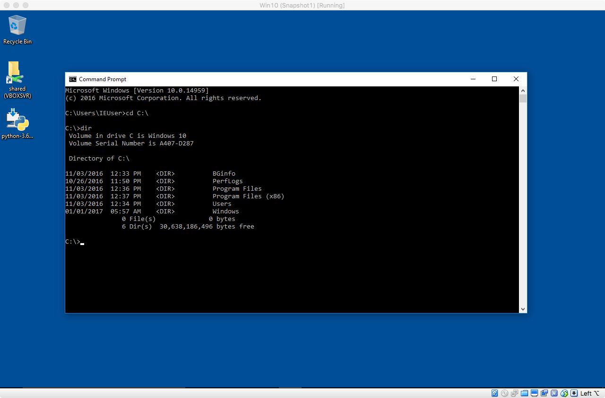

The prompt shows a list of directories and files
that are contained in the ``C:`` drive:
in the above screenshot they are
``BGinfo``, ``PerfLogs``, ..., ``Windows``.

At this point, if you want to enter the ``Users`` directory,
you can simply type ``cd Users``, and so on.

If you want to go up one level, type ``cd ..``
(two full stop character).
For example, if you are in ``C:\Users\`` and give a ``cd ..``,
you will end up in ``C:\``.

If you want to clear the prompt window, use the ``cls`` command.

### Checking That Python Is Installed Correctly

If you selected the **Add Python to PATH** option,
you can run the Python interpreter (and any Python program)
from any current working directory.

To check this, give the ``python --version`` command:

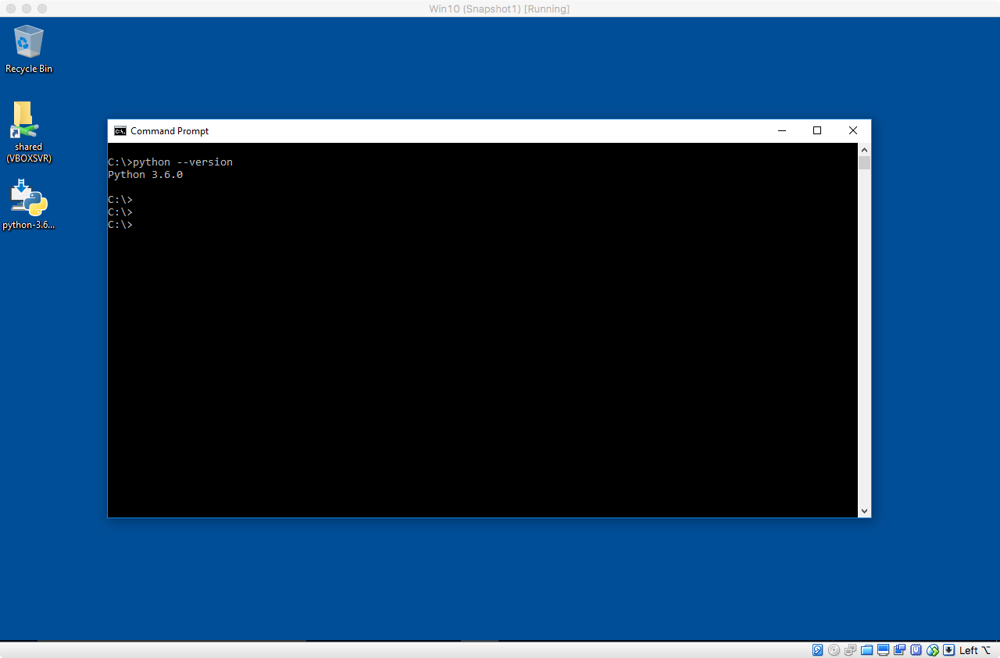

The Python version will be printed
(e.g., ``Python 3.6.0``)
and you will get back to the Windows prompt.
You just ran Python in **non-interactive mode**,
meaning that you provided a precise command
("Python, print the version number you are"),
the Python interpreter performed what you asked for,
and then it returned control to the Command Prompt of Windows.

The **non-interactive mode** is how most Python programs work.

If you forget to add the ``--version`` parameter
after the ``python`` command,
you will enter the **interactive Python shell** instead:

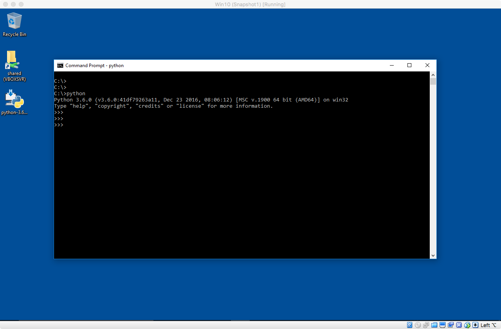

Notice how the prompt changed to ``>>>``.

To exit the Python shell, and return to the Command Prompt,
just type ``quit()`` and hit the Enter/Return key:

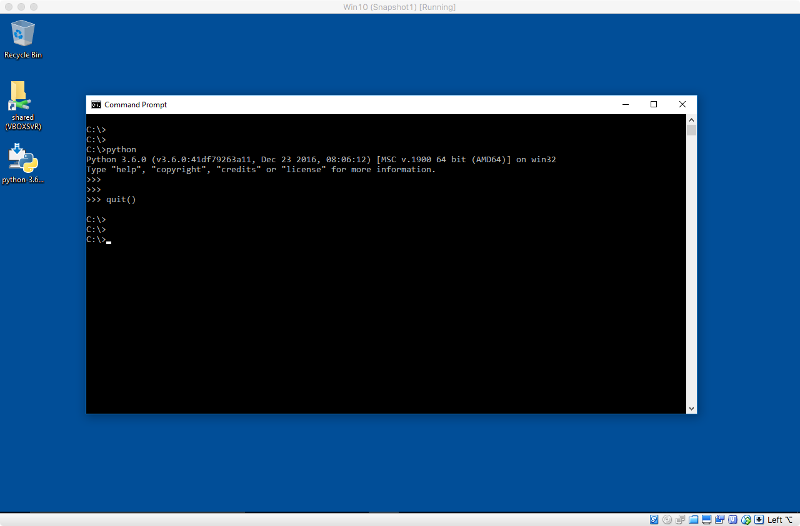

Discussing the interactive shell is beyond the scope of this guide,
since **most programs you are interested in are non-interactive**.


## Running A Python Program

Excellent, now you have all the tools required
to run a Python program on the command line.

As an illustration,
I will use my simple Python script
[``export-kobo``](https://github.com/pettarin/export-kobo/),
which reads annotations and highlights
from the database file of a Kobo eReader device (``KoboReader.sqlite``),
and prints them on the prompt or exports them to an output file.

### Step 1: Download The Source Code

First, download the source code of the Python program you want to run.

This usually implies **downloading** either **a single Python source code** file
(with extension ``.py``), or **a ZIP file containing several Python source code files**
and other resource files that you need to uncompress somewhere on your disk.

The exact details depend on your Python program,
hence be sure to **carefully read its install documentation**.
You can download the prescribed files with your browser,
and then copy/uncompress them using the Windows graphical file manager.

In our example, we download the raw file
[``export-kobo.py``](https://raw.githubusercontent.com/pettarin/export-kobo/master/export-kobo.py)
from the GitHub repository.

Remember **Safety Rule 3**
("copy your Python files into a separate folder")?

We put the downloaded ``export-kobo.py`` file
in a new folder ``C:\export-kobo``:


Note that we also copied
the ``KoboReader.sqlite`` file
(the input of our Python program)
from our Kobo eReader
to the same folder.

### Step 2: Open A Command Prompt And ``cd`` There

Then, open a Command Prompt as explained above,
and change the current working directory to the folder
where you put your Python program source files.

In our example, ``cd C:\export-kobo``:


### Step 3: Run The Python Program

At this point, we are ready to run our program.

Type ``python export-kobo.py KoboReader.sqlite --list`` and hit Enter/Return:


The Python interpreter will load our ``export-kobo.py`` program,
and run it with arguments ``KoboReader.sqlite`` and ``--list``.

Clearly, **the semantics of the arguments vary from program to program**,
depending on what each program is supposed to do.

In our case, ``export-kobo.py`` will read the file
whose name is passed as the first parameter (``KoboReader.sqlite``)
and it will list (``--list`` option) the titles of all the eBooks
with annotations or highlights in the database.

If we specify different command arguments, for example
``python export-kobo.py KoboReader.sqlite --csv --output exported.csv``,
we will get a different behavior:


In particular, this second command exported all the information
contained in the ``KoboReader.sqlite`` file into
the newly created file named ``exported.csv`` in CSV format:

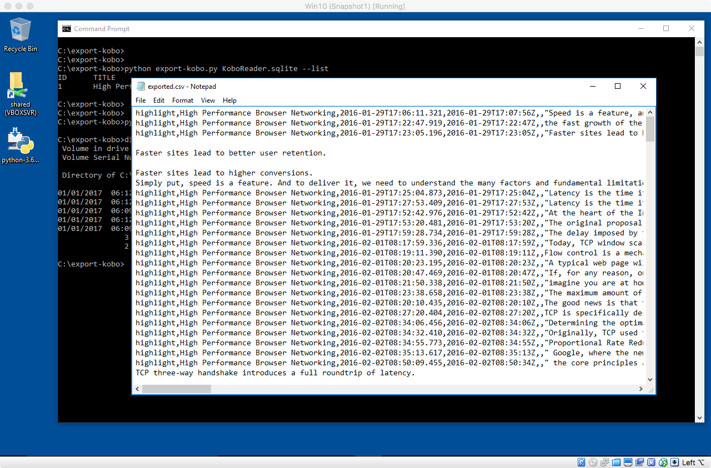

You must **check the documentation** of your Python program
to know the semantics of its arguments.
Most programs, when run without arguments
(or with just a ``-h`` or ``--help`` argument after the program name)
will print an help message in the prompt window.

**Congratulations, now you should be able
to download and run a Python program on your own!**
